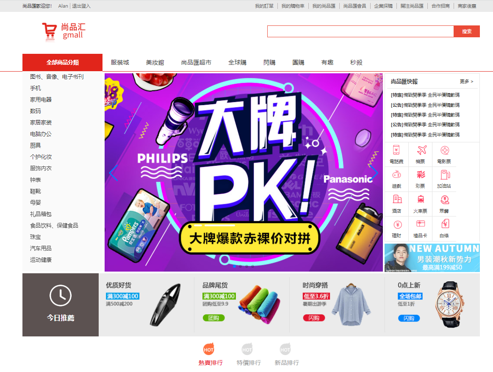

# 大型電商項目-尚品匯

## 項目簡介:

### (1) 此項目為線上電商 Web App (SPA)

### (2) 包括首頁, 搜索頁, 詳情頁, 購物車頁, 訂單頁, 支付頁, 用戶登入頁、註冊頁等多個子組件



---

## 涉及技術:

### (1) Vue CLI

### (2) Vuex

### (3) Vue-router

### (4) Element UI

### (5) Axios 二次封裝

### (6) API 統一管理

### (7) Mock.js

---

## 注意事項

### (1) API 文檔: 取自尚硅谷，改以 Vue2 重構 html,css 並添加 JS 邏輯

### (2) 原後端接口失效，故改用 Mock.js & LocalStorage 模擬後端資料庫

---

## 專案目錄樹

```
.
├─public
│  └─images
└─src
    ├─api
    ├─assets
    ├─components
    │  ├─Footer
    │  ├─Header
    │  ├─Pagination
    │  └─TypeNav
    ├─mock
    ├─pages
    │  ├─AddCartSuccess
    │  ├─Detail
    │  │  ├─ImageList
    │  │  ├─images
    │  │  └─Zoom
    │  ├─Home
    │  │  ├─Brand
    │  │  ├─Floor
    │  │  ├─Like
    │  │  ├─ListContainer
    │  │  ├─Rank
    │  │  └─Recommend
    │  ├─Login
    │  ├─Pay
    │  ├─PaySuccess
    │  ├─Register
    │  ├─Search
    │  │  └─SearchSelector
    │  ├─ShopCart
    │  └─Trade
    ├─router
    ├─store
    │  ├─detail
    │  ├─home
    │  ├─search
    │  ├─shopcart
    │  ├─trade
    │  └─user
    └─utils
```
